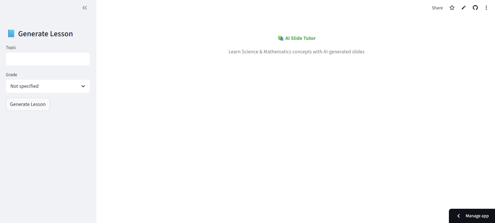
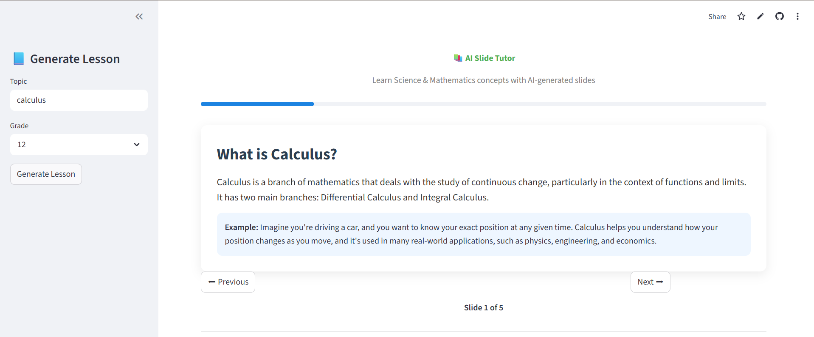
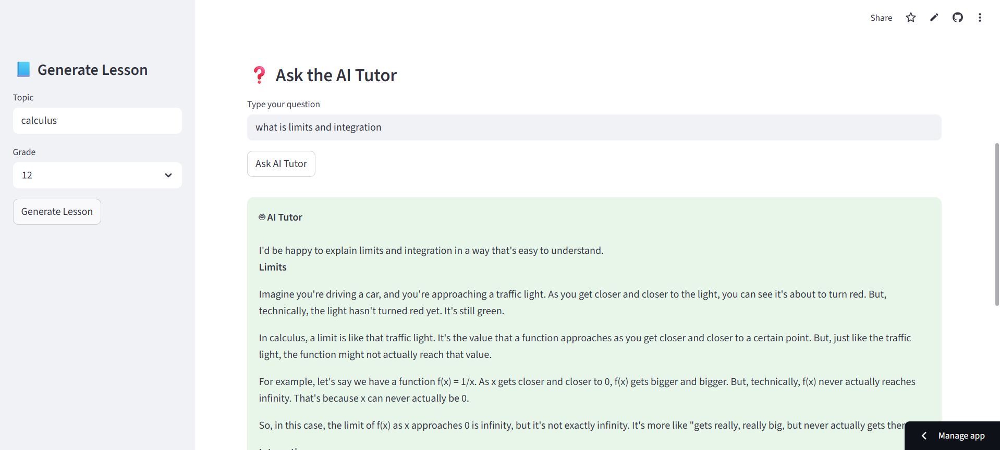

# 📚 AI Slide Tutor

An AI-powered tutoring platform for **K-12 Science and Mathematics** that generates lesson slides and answers student doubts in real time.

This project demonstrates how Large Language Models can be integrated into an educational system to provide interactive learning experiences.

---

## 🚀 Live Demo

https://ai-slide-tutor-12345.streamlit.app/

Frontend (Streamlit):  
https://ai-slide-tutor.streamlit.app

Backend API (FastAPI):  
https://ai-slide-tutor.onrender.com

---

## 🧠 Features

- 📖 **AI Lesson Generation**
  - Enter any topic (e.g., Photosynthesis, Newton's Laws)
  - AI generates structured teaching slides.

- 🧑‍🏫 **AI Tutor for Doubts**
  - Ask questions while viewing slides
  - AI explains concepts in simple terms.

- 🎓 **K-12 Focused Explanations**
  - Content tailored for school-level students.

- ⚡ **Fast AI Inference**
  - Uses Groq LLM infrastructure.

- 🌐 **Fully Deployed System**
  - Frontend and backend deployed online.

---

## 🏗 System Architecture

User
↓
Streamlit Frontend
↓
FastAPI Backend
↓
Groq LLM (Llama Models)
↓
Generated Lessons + Answers

---

## 🛠 Tech Stack

### Frontend
- Streamlit

### Backend
- FastAPI
- Uvicorn

### AI
- Groq API
- Llama models

### Other Tools
- Python
- Requests
- Pydantic
- Python-dotenv

---

## 📂 Project Structure

ai-slide-tutor         
│             
├── backend           
│ ├── main.py           
│ └── routes.py        
│                        
├── services                 
│ ├── lesson_service.py           
│ └── doubt_service.py         
│                        
├── frontend                   
│ └── app.py                
│                       
├── models                 
│ └── schemas.py                 
│                         
├── config                     
│ └── settings.py                
│                      
├── requirements.txt                   
└── README.md                    
                       
                     
---            

## ⚙️ Installation (Run Locally)

### 1️⃣ Clone the repository

git clone https://github.com/YOUR\_USERNAME/ai-slide-tutor.git

cd ai-slide-tutor

---

### 2️⃣ Install dependencies

pip install -r requirements.txt

---

### 3️⃣ Create `.env` file

GROQ_API_KEY=your_api_key                
MODEL_NAME=llama-3.1-8b-instant            
TEMPERATURE=0.3           
MAX_TOKENS=1200          
           

---

### 4️⃣ Run Backend

uvicorn backend.main:app --reload

Backend will run at:

http://127.0.0.1:8000

---

### 5️⃣ Run Frontend

streamlit run frontend/app.py

Frontend will run at:

http://localhost:8501

---

## 📸 Screenshots

### Home Page

### Generated Slides

### AI Tutor Answering Doubts

---

## 🎯 Example Usage

1. Enter topic: **"Photosynthesis"**
2. AI generates slides explaining the concept.
3. Navigate slides using Next/Previous.
4. Ask doubts such as:

Why is sunlight required for photosynthesis?

The AI tutor explains the concept clearly.

---

## 📈 Future Improvements

Possible extensions:

- Quiz generation after lessons
- Diagram generation for concepts
- Voice-based tutoring
- Student learning progress tracking
- Multi-language support

---

## 👨‍💻 Author

Puneeth Kumar  
B.Tech Computer Science Student
Interest: Artificial Intelligence & Machine Learning

---

## 📜 License

This project is for educational purposes.